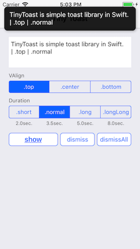
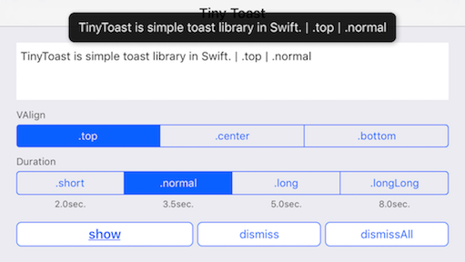
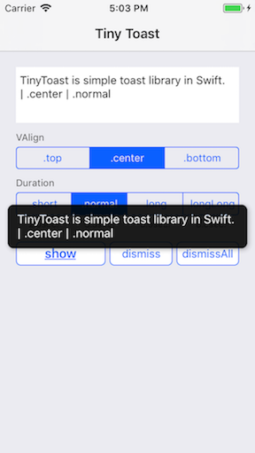
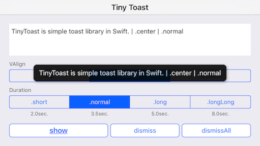
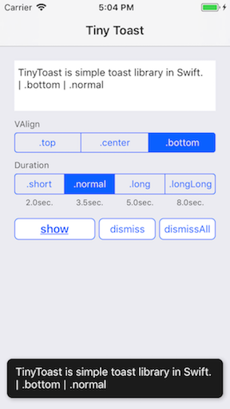
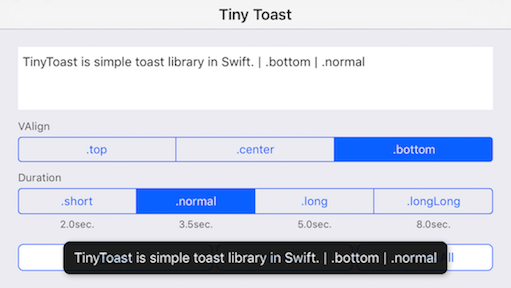

# TinyToast

TinyToast is simple toast library in Swift.

## Requirements
- Swift 4.2
- iOS 9.0 or later

## Installation

### Carthage

* Cartfile

```Cartfile
github "keygx/TinyToast"
```
or

```Cartfile
github "keygx/TinyToast" "branch-name"
```
or

```Cartfile
github "keygx/TinyToast" "tag"
```

* install

```
$ carthage update
```
To integrate "TinyToast.framework" into your Xcode project

## Usage

it will be automatically dismiss at the set time

```Swift
/* VAlign: .top / .center / .bottom */
/* Duration: .short (2.0) / .normal (3.5) / .long (5.0) / .longLong (8.0) / User setting */

TinyToast.shared.show(message: "Message you want to display", valign: .center, duration: .normal)

TinyToast.shared.show(message: "Message you want to display", valign: .center, duration: 15.0) // 15sec.
```
---

If you want to manually dismiss the first toast

```Swift
TinyToast.shared.dismiss()
```

If you want to manually dismiss all toast

```Swift
TinyToast.shared.dismissAll()
```

## Screenshots

 
```Swift
TinyToast.shared.show(message: "TinyToast ...", valign: .top, duration: .normal)
```

 
```Swift
TinyToast.shared.show(message: "TinyToast ...", valign: .center, duration: .normal)
```

 
```Swift
TinyToast.shared.show(message: "TinyToast ...", valign: .bottom, duration: .normal)
```

## License

TinyToast is released under the MIT license. See LICENSE for details.

## Author

Yukihiko Kagiyama (keygx) <https://twitter.com/keygx>
