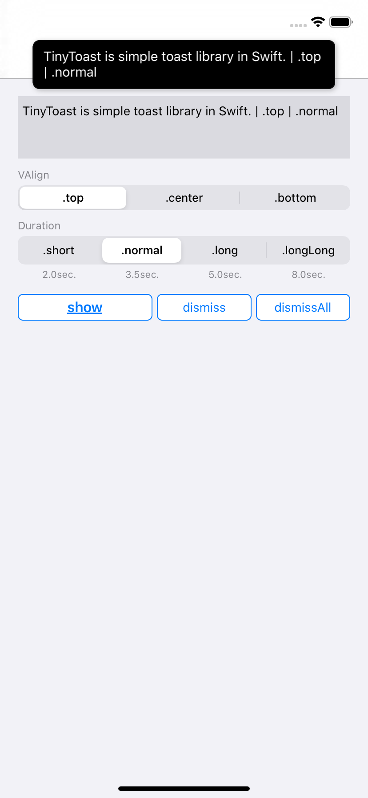

# TinyToast

TinyToast is simple toast library in Swift.

## Requirements
- Swift 5.1
- iOS 9.0 or later

## Installation

### Carthage

```Cartfile
github "keygx/TinyToast"
```

### Swift versions support

- Swift 5.1, tag "swift5.1"
- Swift 5, tag "swift5"
- Swift 4.2, tag "swift4.2"
- Swift 4.1, tag "swift4.1"
- Swift 4.0, tag "swift4.0"


## Usage

it will be automatically dismiss at the set time

```Swift
/* VAlign: .top / .center / .bottom */
/* Duration: .short (2.0) / .normal (3.5) / .long (5.0) / .longLong (8.0) / User setting */

TinyToast.shared.show(message: "Message you want to display", valign: .center, duration: .normal)

TinyToast.shared.show(message: "Message you want to display", valign: .center, duration: 15.0) // 15sec.
```
---

If you want to manually dismiss the first toast

```Swift
TinyToast.shared.dismiss()
```

If you want to manually dismiss all toast

```Swift
TinyToast.shared.dismissAll()
```

## Screenshots

- Support to iOS13 and Dark Mode

| Light | Dark |
|:---:|:---:|
| .top | .top |
|  |  |
| .center | .center |
|  |  |
| .bottom | .bottom |
|  |  |

| Light |
|:---:|
| .top |
|  |
| .center |
|  |
| .bottom |
|  |

| Dark |
|:---:|
| .top |
|  |
| .center |
|  |
| .bottom |
|  |

## License

TinyToast is released under the MIT license. See LICENSE for details.

## Author

Yukihiko Kagiyama (keygx) <https://twitter.com/keygx>
